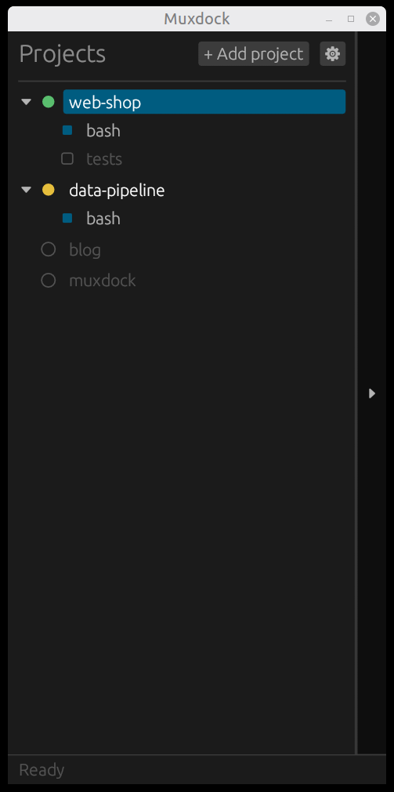
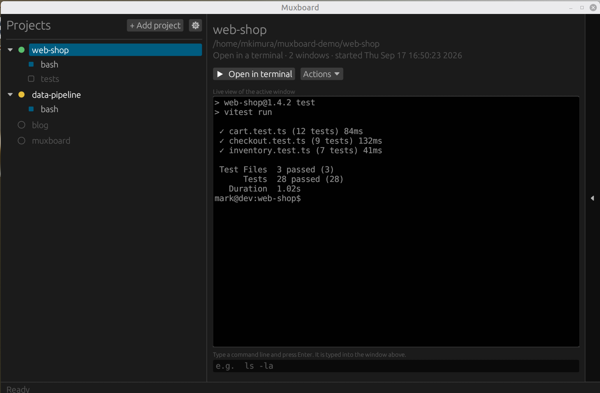

# Muxdock

A small desktop board for your projects. Each project is a folder; Muxdock starts a tmux session in it, shows you what is running, and lets you open it in a terminal, all with clicks. No tmux keyboard shortcuts to remember.

It was built to juggle several [Claude Code](https://claude.com/claude-code) sessions across projects, but the start command is yours to set, so it works for any terminal program: `claude`, `vim`, `htop`, a dev server, a shell.

<p>
  
  
</p>

Left: the default, a narrow project list. Right: the same window with the preview panel opened from the edge tab.

## What it does

- **Project list.** Register folders. A green dot means a terminal window is open on the project's session, a yellow dot means the session runs with no terminal open, a dimmed name means nothing is running. Windows of a running session are nested under the project.
- **Start with a double-click.** For an idle project, Muxdock creates a tmux session in its folder, types the start command into it (default `claude --continue`), and opens a terminal on it. For a running project, it opens a terminal, or switches the one already open to the window you clicked.
- **Live preview.** A read-only view of the selected window's text, including scrollback, refreshed every second. A command box underneath types a line into that window.
- **Session and window actions** by right-click: new window, rename, make active, close terminals while keeping the session, kill, open the folder in your file manager.
- **Ordering.** By status (default), by name, or manual with drag-to-reorder. Right-click the empty space under the list.
- **Small by default.** The window opens as a narrow list. A tab on its right edge opens the preview panel; drag the tab to change the width.

tmux sessions that belong to no project are listed under "Unassigned tmux sessions" with the same actions, plus "Add as project", which registers the session's folder under the session's name.

## Install

Requirements: Linux (X11 or Wayland) or macOS, `tmux`, a terminal emulator, and a Rust toolchain ([rustup](https://rustup.rs)).

```sh
git clone https://github.com/mark-kimura/muxdock.git
cd muxdock
cargo build --release
./target/release/muxdock
```

On Debian/Ubuntu/Mint the GUI library needs these packages to build:

```sh
sudo apt install build-essential pkg-config libgtk-3-dev libxkbcommon-dev libssl-dev
```

To add it to the desktop menu, install the icon and create `~/.local/share/applications/muxdock.desktop`:

```sh
install -Dm644 assets/icon.png ~/.local/share/icons/hicolor/256x256/apps/muxdock.png
```


```ini
[Desktop Entry]
Type=Application
Name=Muxdock
Comment=Start and manage tmux sessions per project
Exec=/full/path/to/muxdock/target/release/muxdock
Icon=muxdock
StartupWMClass=muxdock
Terminal=false
Categories=Utility;
```

### macOS

```sh
brew install tmux
git clone https://github.com/mark-kimura/muxdock.git
cd muxdock
./scripts/make-app.sh      # builds target/Muxdock.app
open target/Muxdock.app   # or drag it into /Applications
```

Sessions open in iTerm2 if it is installed, otherwise in Terminal. Set "Terminal program" in Settings to `Terminal`, `iTerm`, `kitty`, `alacritty`, or `wezterm` to choose. The first time, macOS asks for permission to control Terminal or iTerm; allow it. "Open folder" opens Finder. Config lives in `~/Library/Application Support/muxdock/`.

## Settings

The gear button opens Settings:

- **Default start command.** Typed into a new session when a project is started. Blank means a plain shell.
- **Terminal program.** Which terminal to open sessions in. Blank means `$TERMINAL` if set, otherwise the first of gnome-terminal, kitty, alacritty, wezterm, konsole, xfce4-terminal, tilix, foot, xterm found on the machine.

"Edit project" on a project's right-click menu sets its name, folder, and a start command that overrides the default.

Files (Linux): `~/.config/muxdock/projects.json` and `~/.config/muxdock/settings.json`. Set `MUXDOCK_CONFIG_DIR` to use a different folder. `MUXDOCK_EXPANDED=1` starts with the preview panel open.

## How it works

Muxdock is a thin layer over the `tmux` command line: `list-sessions`, `list-windows`, `capture-pane`, `send-keys`, `new-session`, `select-window`, and so on. A project is matched to a session by the folder the session was started in. The GUI is [egui](https://github.com/emilk/egui). Written in Rust.

## License

MIT. See [LICENSE](LICENSE).
